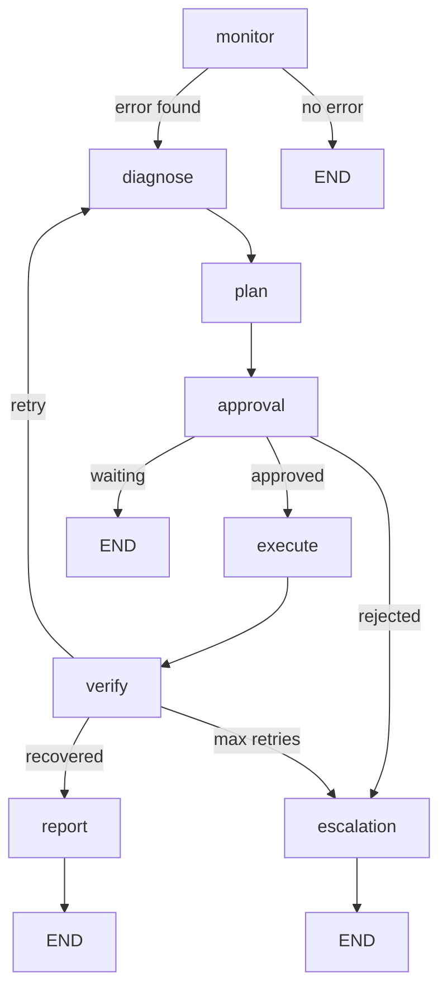

## Overview

The agent graph is the core orchestration layer of Sentinel AI, built on LangGraph's `StateGraph`. It defines the workflow for monitoring services, diagnosing issues, planning remediation, and executing recovery commands.

## Architecture

Sentinel uses a state machine architecture with conditional edges to handle different failure scenarios:

```python
from langgraph.graph import StateGraph, END
from src.agent.graph import workflow, app
from src.agent.state import AgentState
```

## StateGraph

The `StateGraph` is initialized with the `AgentState` type and configured with nodes and edges.

### Workflow Nodes

The main workflow includes these nodes:

<CardGroup cols={2}>
  <Card title="monitor" icon="radar">
    Checks service health via SSH
  </Card>
  <Card title="diagnose" icon="stethoscope">
    Analyzes errors using LLM + RAG
  </Card>
  <Card title="plan" icon="lightbulb">
    Generates remediation commands
  </Card>
  <Card title="approve" icon="shield-check">
    Validates command security
  </Card>
  <Card title="execute" icon="terminal">
    Runs approved commands via SSH
  </Card>
  <Card title="verify" icon="circle-check">
    Confirms service recovery
  </Card>
  <Card title="report" icon="file-lines">
    Logs success details
  </Card>
  <Card title="escalation" icon="triangle-exclamation">
    Triggers human intervention
  </Card>
</CardGroup>

## Workflow Configuration

### Adding Nodes

```python
workflow = StateGraph(AgentState)

# Register node functions
workflow.add_node("monitor", monitor_node)
workflow.add_node("diagnose", diagnose_node)
workflow.add_node("plan", plan_node)
workflow.add_node("approval", approve_node)
workflow.add_node("execute", execute_node)
workflow.add_node("verify", verify_node)
workflow.add_node("report", report_node)
workflow.add_node("escalation", escalation_node)
```

### Setting Entry Point

```python
# Start workflow at monitor node
workflow.set_entry_point("monitor")
```

### Adding Edges

**Simple Edges** connect nodes in sequence:

```python
workflow.add_edge("diagnose", "plan")
workflow.add_edge("plan", "approval")
workflow.add_edge("execute", "verify")
workflow.add_edge("report", END)
workflow.add_edge("escalation", END)
```

**Conditional Edges** route based on state:

```python
workflow.add_conditional_edges(
    "monitor",
    should_monitor_end,
    {"end": END, "continue": "diagnose"}
)

workflow.add_conditional_edges(
    "approval",
    should_approve_continue,
    {"execute": "execute", "escalate": "escalation", "end": END}
)

workflow.add_conditional_edges(
    "verify",
    should_verify_end,
    {"end": "report", "retry": "diagnose", "escalate": "escalation"}
)
```

## Conditional Functions

These functions evaluate state and return routing keys:

### should_monitor_end

```python
def should_monitor_end(state: AgentState):
    if not state.get("current_error"):
        return "end"
    return "continue"
```

<ParamField path="state" type="AgentState" required>
  Current workflow state containing error information
</ParamField>

<ResponseField name="return" type="str">
  Returns `"end"` if no errors detected, otherwise `"continue"`
</ResponseField>

### should_approve_continue

```python
def should_approve_continue(state: AgentState):
    status = state.get("approval_status")
    if status == "REJECTED":
        return "escalate"
    elif status == "WAITING_APPROVAL":
        return "end"
    return "execute"
```

<ParamField path="state" type="AgentState" required>
  State containing `approval_status` field
</ParamField>

<ResponseField name="return" type="str">
  Returns `"escalate"`, `"end"`, or `"execute"` based on approval status
</ResponseField>

### should_verify_end

```python
def should_verify_end(state: AgentState):
    if not state.get("current_error"):
        return "end"
    retry_count = state.get("retry_count", 0)
    if retry_count >= config.MAX_RETRIES:
        return "escalate"
    return "retry"
```

<ParamField path="state" type="AgentState" required>
  State with `current_error` and `retry_count` fields
</ParamField>

<ResponseField name="return" type="str">
  Returns `"end"` if recovered, `"escalate"` if max retries exceeded, otherwise `"retry"`
</ResponseField>

## Compiling the Graph

Compile the workflow into an executable application:

```python
app = workflow.compile()
```

The compiled `app` can be invoked with initial state:

```python
initial_state = {
    "messages": [],
    "current_step": "",
    "current_error": None,
    "affected_service": None,
    "diagnosis_log": [],
    "candidate_plan": None,
    "approval_status": "PENDING",
    "retry_count": 0,
    "memory_consulted": False,
    "security_flags": [],
    "escalation_reason": None
}

result = app.invoke(initial_state)
```

## Resume Workflow

Sentinel includes a separate `resume_workflow` for continuing paused executions:

```python
resume_workflow = StateGraph(AgentState)
# ... add same nodes ...
resume_workflow.set_entry_point("execute")  # Start at execute
resume_app = resume_workflow.compile()
```

<Note>
  The resume workflow starts at the `execute` node, allowing users to approve pending commands and continue execution without re-diagnosing.
</Note>

## Running the Workflow

### Basic Invocation

```python
from src.agent.graph import app

# Run complete workflow
final_state = app.invoke(initial_state)

print(f"Final step: {final_state['current_step']}")
print(f"Service status: {final_state['affected_service']}")
```

### Resuming After Approval

```python
from src.agent.graph import resume_app

# Load paused state
paused_state = load_state_from_db(session_id)

# Update approval status
paused_state["approval_status"] = "APPROVED"

# Resume execution
final_state = resume_app.invoke(paused_state)
```

## State Management

Each node receives the current state and returns updates:

```python
def example_node(state: AgentState) -> Dict[str, Any]:
    # Access current state
    error = state.get("current_error")
    service = state.get("affected_service")
    
    # Perform operations
    # ...
    
    # Return state updates
    return {
        "current_step": "example",
        "diagnosis_log": state.get("diagnosis_log", []) + ["New diagnosis"]
    }
```

<Warning>
  Node functions must return a dictionary with state updates. LangGraph merges these updates with the existing state.
</Warning>

## Workflow Execution Flow



## Configuration

Workflow behavior is controlled via `config.py`:

<ParamField path="MAX_RETRIES" type="int" default="3">
  Maximum number of recovery attempts before escalation
</ParamField>

<ParamField path="MODEL_NAME" type="str" default="gpt-4">
  LLM model for diagnosis and planning nodes
</ParamField>

<ParamField path="TEMPERATURE" type="float" default="0.0">
  LLM temperature for consistent command generation
</ParamField>

## Error Handling

The graph handles errors through state management:

```python
# Error detected in monitor node
if service_down:
    return {
        "current_step": "monitor",
        "current_error": "Service nginx not responding",
        "affected_service": "nginx"
    }

# Error cleared in verify node
if service_recovered:
    return {
        "current_step": "verify",
        "current_error": None  # Clear error
    }
```

<Tip>
  Use `current_error: None` to signal recovery. This triggers the workflow to proceed to the success path.
</Tip>

## Best Practices

1. **Immutable State Updates**: Always return new dictionaries, never mutate state directly
2. **Idempotent Nodes**: Design nodes to be safely re-executable
3. **Clear Error Signals**: Set `current_error` to descriptive strings
4. **Logging**: Use `log()` from `event_bus` to track execution
5. **Graceful Degradation**: Handle missing state fields with `.get()` and defaults

## Advanced Usage

### Custom Conditional Logic

```python
def custom_routing(state: AgentState) -> str:
    service = state.get("affected_service")
    error = state.get("current_error", "")
    
    # Route based on service type
    if "database" in service:
        return "database_recovery"
    elif "timeout" in error.lower():
        return "network_diagnostics"
    return "standard_flow"

workflow.add_conditional_edges(
    "diagnose",
    custom_routing,
    {
        "database_recovery": "db_plan",
        "network_diagnostics": "network_check",
        "standard_flow": "plan"
    }
)
```

### Parallel Node Execution

While LangGraph executes nodes sequentially, you can parallelize operations within nodes:

```python
import asyncio

async def parallel_checks(state: AgentState):
    services = config.SERVICES.keys()
    
    # Check all services concurrently
    results = await asyncio.gather(*[
        check_service(svc) for svc in services
    ])
    
    return {"service_statuses": dict(zip(services, results))}
```

## Related

<CardGroup cols={2}>
  <Card title="Agent Nodes" icon="cube" href="/sdk/nodes">
    Detailed documentation for each node function
  </Card>
  <Card title="State Schema" icon="database" href="/sdk/state">
    Complete AgentState TypedDict reference
  </Card>
  <Card title="SSH Client" icon="terminal" href="/sdk/ssh-client">
    Execute remote commands in nodes
  </Card>
  <Card title="Knowledge Base" icon="brain" href="/sdk/knowledge-base">
    Query RAG system in diagnosis
  </Card>
</CardGroup>